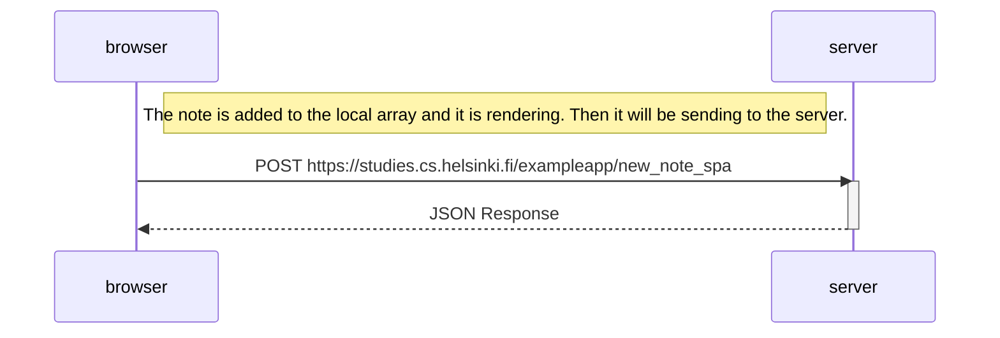

# User sends a note with SPA

```mermaid
sequenceDiagram
    participant browser
    participant server

    Note right of browser: The note is added to the local array and it is rendering. Then it will be sending to the server.

    browser->>server: POST https://studies.cs.helsinki.fi/exampleapp/new_note_spa
    activate server
    server-->>browser: JSON Response
    deactivate server

```